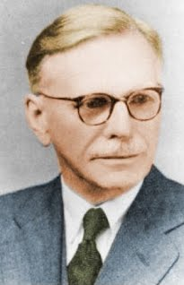

# 👅 07.TAL 1

## 22 février 2024

Parmi les autres applications de la programmation qui peuvent être pertinentes pour les journalistes, on trouve ce qu'on appelle le [**traitement automatique du langage naturel**](https://fr.wikipedia.org/wiki/Traitement\_automatique\_du\_langage\_naturel) (ou des langues naturelles; TALN, qu'on raccourcit aussi à TAL). Vous rencontrerez, en anglais, l'expression _NLP_ pour _Natural Language Processing_.

Il arrive souvent, en journalisme, qu'on veuille extraire du sens d'un important corpus de texte (des articles ou chroniques, des transcriptions de débats parlementaires, des publications Facebook, etc.). C'est possible, grâce au TAL.

Avant de procéder, on va faire un peu de théorie sur cette discipline en abordant les différentes étapes de **pré-traitement** qu'on peut faire subir à un corpus de textes et en définissant certaines notions telles que :

* l'analyse lexicale (ou _tokenization_)
* la lemmatisation (ou _lemmatization_)
* la racinisation (ou _stemming_)
* l'étiquettage morpho-syntaxique (ou _part-of-speech tagging_)
* les mots-vides (ou _stopwords_)
* les entités nommées (ou _named entities_)
* l'analyse de sentiment (ou _sentiment analysis_)

Puis, on va apprendre comment analyser un corpus de texte à l'aide d'un outil relativement nouveau appelé [spaCy](https://spacy.io/).

On va aller au-delà du simple nuage de mots. Car comme le disait le linguiste britannique John R. Firth, **un mot seul n'est rien sans son contexte**. Les mots seuls peuvent avoir plusieurs significations. C'est en regardant quels sont les mots qui se trouvent avant et après qu'ils prennent tout leur sens.

> _« You shall know a word by the company it keeps »_
>
> \-- John Rupert Firth (1890-1960)

