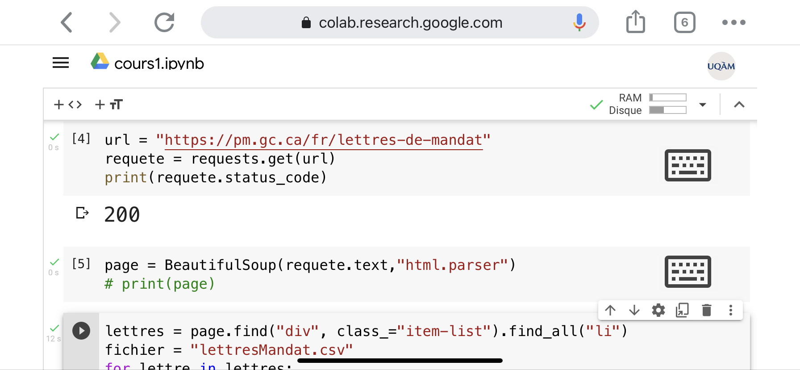

# ✨ Méthode

Le contenu de ce cours colle davantage à ce qu'on appelle, dans le monde anglo-saxon, du [_Computational journalism_](https://cj2022.brown.columbia.edu/). Il s'agit de l'application de l'informatique au journalisme.

Même le plan de cours que vous consultez en ce moment est un exemple de ce qu'on peut faire avec ces technologies. Il repose sur un système appelé [_git_](https://fr.wikipedia.org/wiki/Git), qui permet de collaborer à plusieurs sur un même projet et de voir les différentes versions d'un même fichier (pour voir comment ce plan de cours a évolué, consultez [ce répertoire sur le compte Github du programme](https://github.com/Journalisme-UQAM/edm4466\_h2023)).

Mais ce qu'on fera, surtout, c'est d'apprendre la **programmation** et ses applications journalistiques.

Le langage qu'on utilisera s'appelle [**Python**](https://www.python.org/). C'est un langage d'usage général qui est l'un des plus utilisés dans le monde. C'est celui qui, en 2023 et pour la prochaine décennie au moins, me paraît le plus utile pour vous comme journalistes et comme citoyen.nes. **JavaScript** est plus couramment utilisé par des informaticien.nes, mais il est difficile à appréhender pour des gens qui n'ont jamais programmé. Le langage **R** est très utilisé par mes collègues en sciences humaines et sociales, mais en dehors des cercles académiques, il demeure plutôt inusité.

Python a ses avantages et ses inconvénients, comme tous les langages informatiques. C'est celui que j'ai choisi, car il est devenu la _lingua franca_ dans l'univers de l'« intelligence artificielle » et de la science des données. C'est aussi un langage que comprendront les informaticien.nes que vous croiserez peut-être dans les rédactions où vous travaillerez. Enfin, son grand nombre d'utilisateurs fait en sorte que vous pourrez compter sur une grande communauté pour répondre aux questions que vous poserez certainement en ligne au cours de la session.

Plus concrètement, on s'en servira pour :

* **moissonner** des données, ou faire du _data scraping,_
* **extraire du sens** de grands volume de texte avec du **traitement du langage naturel** (ou _Natural Language Processing \[NLP]_),
* **se familiariser** avec différentes techniques d'« intelligence artificielle » appliquée, ou d'**apprentissage automatique** (Machine Learning \[ML]),
* **analyser** des données lorsqu'elles sont trop volumineuses pour un tableur comme _Excel_ ou _Calc_ de LibreOffice.

On va le faire au moyen de [Google Colaboratory](https://colab.research.google.com), ou [**Colab**](https://colab.research.google.com). Pour ce faire, il faut que vous disposiez d'un compte Google (si vous vous servez déjà de Gmail et/ou de Google Drive, tout va bien).

Je ne suis pas un _cheerleader_ des GAFA. Mais si j'ai opté pour Colab, c'est après avoir jonglé avec plusieurs autres options au cours des sessions précédentes :

* en 2016 et 2017, je demandais aux étudiant.es d'utiliser [Cloud9](https://aws.amazon.com/fr/cloud9/); ce service en ligne a cependant été acheté par Amazon qui l'a intégré à ses AWS (Amazon Web Services) et l'a rendu payant :skull::exclamation:
* à partir de 2018, j'ai demandé à tout le monde d'installer sur son ordi [Anaconda](https://www.anaconda.com/), une plateforme d'analyse de données. On réutilisait [Sublime Text](https://www.sublimetext.com/), comme dans le EDM4455 (_nostalgie_) pour écrire du code. Mais cela se traduisait par une expérience différente selon que vous possédiez un ordinateur avec Windows ou avec Mac. En outre, les personnes munies d'un Chromebook étaient larguées (elles pouvaient utiliser [CodeAnywhere](https://codeanywhere.com/) ou [PythonAnywhere](https://www.pythonanywhere.com/), des services cependant payants). En 2020, j'ai même introduit un éditeur de code professionnel : [Visual Studio Code](https://code.visualstudio.com/).
* à l'été 2020, j'ai donné avec deux collègues de la Faculté des sciences le cours [Initiation à la science des données et à l'intelligence artificielle](https://etudier.uqam.ca/cours?sigle=INF7100). C'était entre les deux premières vagues de la pandémie et le cours a exclusivement été donné en ligne. Je me suis alors servi des [Azure Notebooks](https://portal.azure.com), un service auquel toute personne qui travaille ou étudie à l'UQAM avait accès gratuitement dans le cadre de l'abonnement de l'université à Office365... j'utilise l'imparfait parce que ce service n'existe plus...
* En 2022, j'ai exploré des solutions de rechange comme [PyCharm](https://www.jetbrains.com/fr-fr/pycharm/), [Gitpod](https://www.gitpod.io/), [Glitch](https://glitch.com) ou les [Codespaces de Github](https://github.com/features/codespaces). Pour toutes sortes de raisons, je ne les trouvais pas appropriés pour cette session au cours de laquelle les risques de reconfinement sont grands et où j'ai besoin d'une solution en ligne.

**Colab** ressemble aux Azure Notebooks qui avaient très bien fonctionné en 2020. Ce service m'est donc apparu comme la meilleure solution et a très bien fonctionné au cours de la session d'hiver 2022. **Nous allons donc continuer de nous en servir cette session-ci**.

Ce service devrait donc fonctionner, quel que soit l'ordi que vous possédez : Mac, Windows, Linux, ChromeBook... Je l'ai même testé sur un téléphone dans l'application Chrome :scream: !! Pas très pratique cependant...

Il permet de programmer à l'intérieur de ce qu'on appelle des **carnets**, ou _**notebooks**_, en anglais. Vous me rendrez d'ailleurs vos devoirs sous la forme de carnets.

Lorsque ce sera nécessaire, je partagerai au préalable avec vous des fichiers qui seront utiles dans le cadre des exercices en classe dans [ce répertoire partagé sur Google Drive](https://bit.ly/fichColab23), répertoire auquel vous pouvez aussi accéder directement à partir de Colab.

### Ce cours est un échange

Je reste ouvert à vos **demandes spéciales**. Vous avez entendu parler d'un projet, d'un reportage retentissant, d'une technologie, d'une application particulière en journalisme? Si je puis vous aider à l'appréhender, voire la réaliser, je vais tâcher de le faire. La meilleure façon d'apprendre est avec un projet concret.

Inversement, si vous connaissez une technique, un outil, un truc, n'hésitez jamais à le **partager** avec l'ensemble du groupe. Parlez-m'en au préalable et on pourra prévoir une période dans le prochain cours pour que vous puissiez nous le ou la présenter. Si vous pouvez vous aussi m'apprendre quelque chose, je serai le prof le plus heureux du monde.

> ### _Il n'y a aucune honte à admettre qu'on ignore quelque chose. La seule honte est de prétendre avoir réponse à tout._
>
> * Neil deGrasse Tyson

