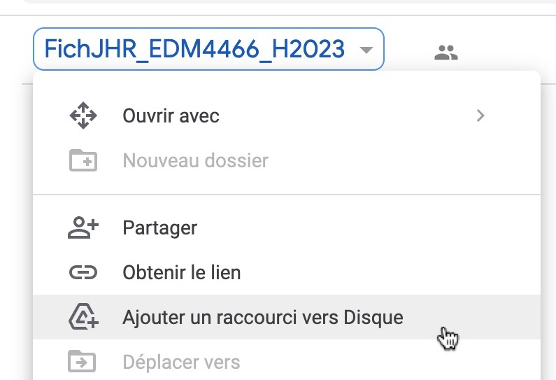
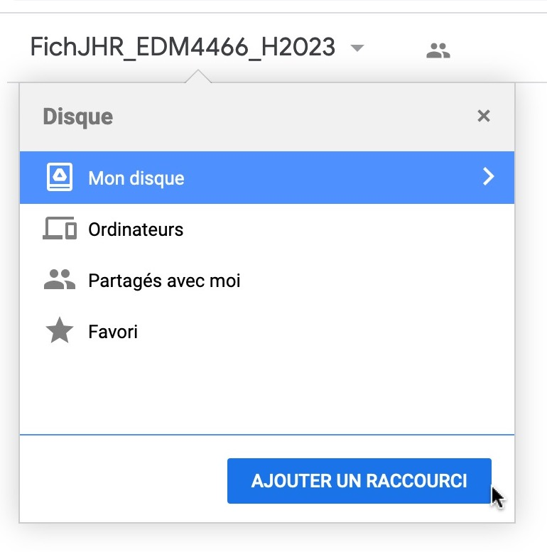
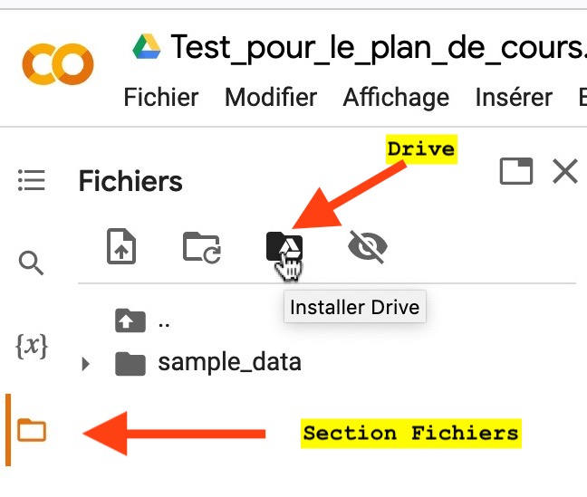
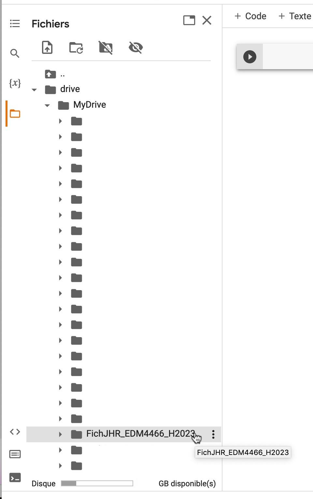

# 🗃 Répertoire Google Drive

Dans certains cours, on travaillera à partir de fichiers que je rendrai au préalable disponibles ici plutôt que de vous les envoyer par courriel ou par 🕊️ voyageur. En voici l'adresse :

#### [https://bit.ly/fichColab23](https://bit.ly/fichColab23)

Pour pourvoir utiliser dans vos carnets Colab les fichiers qui s'y trouveront, voici la façon de faire.

#### Après avoir accédé à ce dossier, créez un _raccourci_ vers votre Google Drive

<figure><figcaption></figcaption></figure>

<figure><figcaption></figcaption></figure>

#### Autorisez Colab à accéder à Drive

Une fois ce raccourci créé, dans Colab, vous aurez à autoriser Colab à accéder à votre Drive.

<figure><figcaption></figcaption></figure>

<figure><figcaption></figcaption></figure>

#### Le répertoire devrait être accessible

Une fois cette autorisation effectuée, il faudra peut-être patienter un brin. Mais vous devriez voir le dossier appelé **« FichJHR\_EDM4466\_H2023 »** dans la section _Fichiers_, répertoire _drive > MyDrive_, ou plus précisément _**content > drive > MyDrive**._

<figure><figcaption></figcaption></figure>
